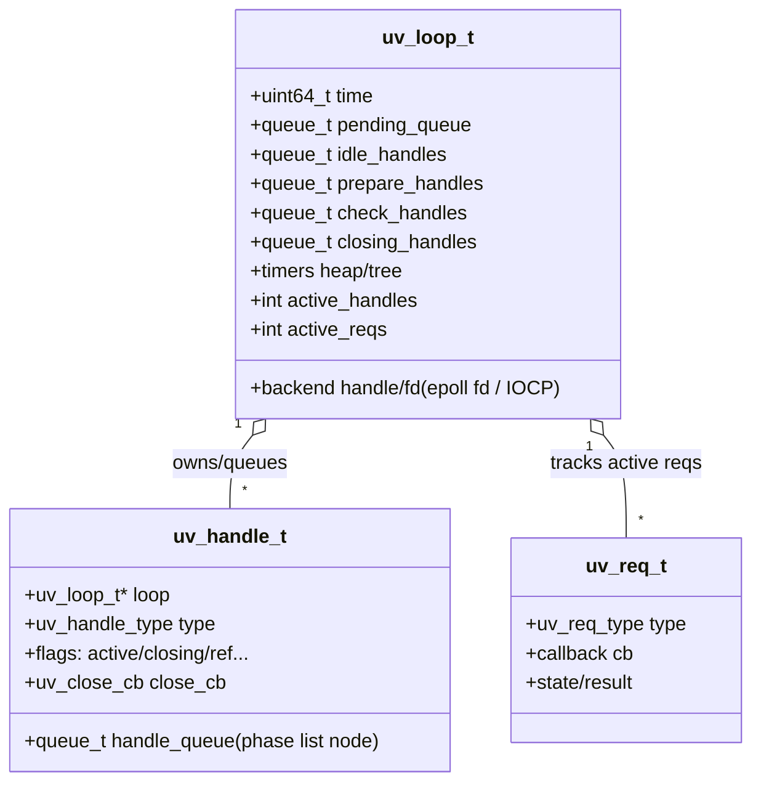
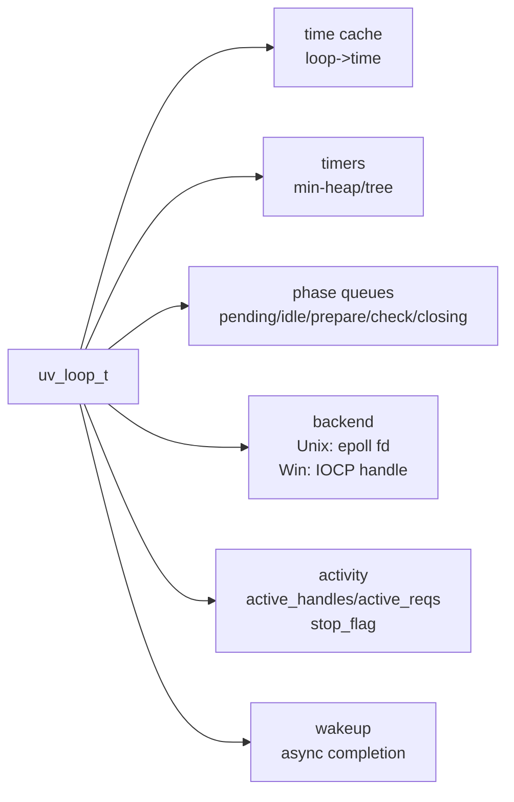
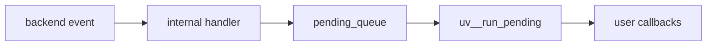
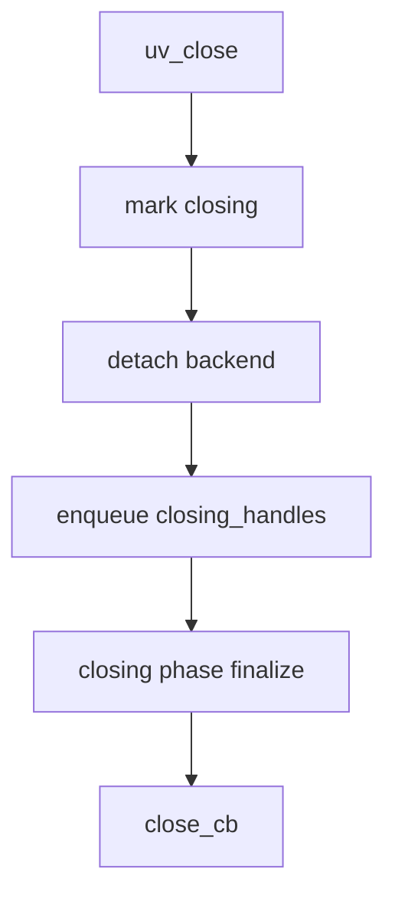
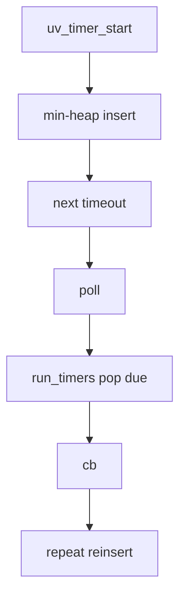
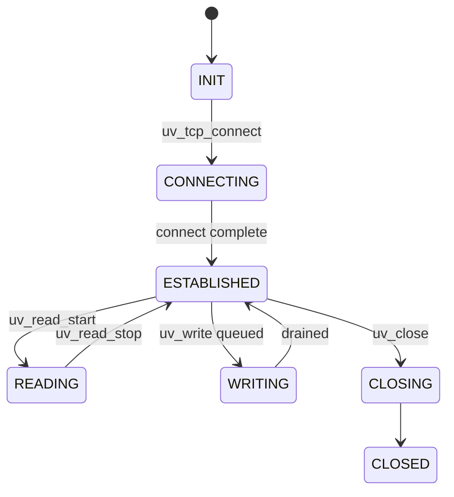
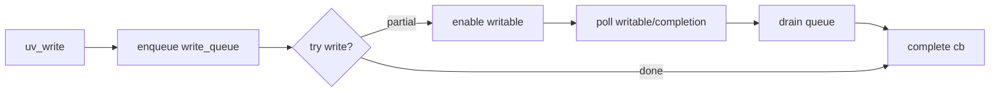
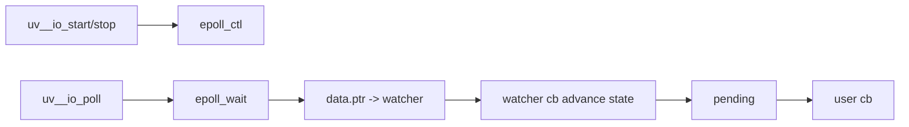
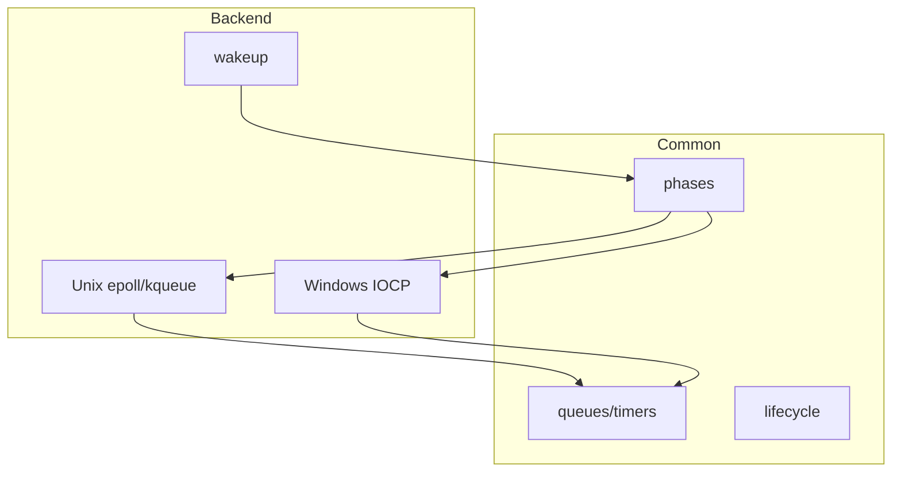
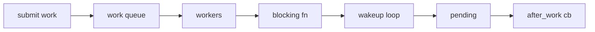

libuv 工程级深度学习文档（源码阅读指南）

面向：需要读懂事件循环、跨平台后端与关键数据结构的工程师
版本说明：以主干语义为准，不同 tag 细节以源码为准

本文目标：把 libuv 从“会用”提升到“能读源码、能定位问题、能解释设计取舍”。内容不仅讲 API 用法，更强调实现机制、设计哲学、关键数据结构与平台后端。

# 目录

1. 1. 设计哲学与整体架构
1. 2. 核心抽象：Handle / Request / Loop
1. 3. uv_loop_t 结构深剖（字段分组、队列语义、不变量）
1. 4. uv_run 执行流程（phase 顺序、timeout 计算、pending/close 队列）
1. 5. pending queue：避免重入与调度公平性
1. 6. close queue：两段式关闭与资源收口
1. 7. Timer 子系统：时间缓存、最小堆、repeat 与漂移
1. 8. I/O 观察者与 Stream 状态机：TCP 读写、背压、写队列
1. 9. Linux：epoll 后端调用链（epoll_ctl/epoll_wait/事件分发）
1. 10. Windows：IOCP 完成模型与 libuv 映射
1. 11. 跨平台抽象层设计：最小后端接口与一致性语义
1. 12. 线程池与异步补洞：uv_queue_work / FS / DNS
1. 13. 源码阅读顺序与实战建议（从主干到分支）
1. 附录 A：常见竞态与调试路径
1. 附录 B：面试题库（按主题）
# 1. 设计哲学与整体架构

libuv 不是简单的 event loop 实现，而是一套“跨平台异步 I/O 抽象 + 统一调度模型”。它的设计哲学可以概括为：一致的上层语义、最小的后端接口、可预测的回调调度，以及对竞态与重入的工程防护。

## 1.1 设计哲学要点

- 统一语义而非统一能力：API 行为在不同平台尽量一致，但不强行暴露所有平台特性。
- Handle/Request 二元模型：Handle 表示长期资源与生命周期；Request 表示一次性异步操作与完成回调。
- 事件循环是调度器：核心任务是把“应该运行的回调”在正确阶段调度运行，而不是承载业务逻辑。
- 后端最小化：Unix 用 epoll/kqueue 等“就绪通知”；Windows 用 IOCP“完成通知”；差异被封装在后端。
- 安全点与阶段化（phases）：通过 pending/prepare/poll/check/closing/timers 等阶段降低重入风险并提升可预测性。
## 1.2 架构图

```mermaid
flowchart TB
  subgraph APP[用户代码]
    A1[uv_loop_init / uv_run]
    A2[uv_tcp_init / uv_read_start / uv_timer_start]
    A3[callback: on_read/on_write/on_close/...]
  end

  subgraph API[对外 API 层 include/uv.h]
    B1[uv_* API]
    B2[uv_loop_t / uv_handle_t / uv_req_t]
  end

  subgraph COMMON[通用核心层 src/uv-common.c + src/queue.h]
    C1[handle lifecycle\nref/unref, close]
    C2[request dispatch\nsubmit/complete]
    C3[event loop phases\npending/idle/prepare/poll/check/closing]
    C4[time & timers]
  end

  subgraph BACKEND[平台后端]
    D1[Unix: epoll/kqueue/...]
    D2[Windows: IOCP]
    D3[wakeup机制\n(eventfd/pipe/WSAEvent/PostQueuedCompletionStatus)]
  end

  APP --> API --> COMMON --> BACKEND
  BACKEND --> COMMON --> APP
```

### 常见误区

- 把 libuv 当成“线程库/协程库”。libuv 的线程池是补洞，主轴仍是事件循环。
- 认为跨平台必然性能差。libuv 的策略是通用层薄、后端特化，性能可逼近原生。
- 忽视回调调度顺序（phases），导致对时序的错误假设。
### 面试问题

1. Handle 与 Request 有什么区别？为什么要分离？
1. libuv 的跨平台抽象边界在哪里？什么必须在后端实现？
1. 为什么要设计 pending/prepare/check 这些阶段？
### 总结

理解 libuv 的哲学：一致语义 + 最小后端 + 阶段化调度 + 工程安全点，是后续读 uv_loop_t 和 uv_run 的基础。

# 2. 核心抽象：Handle / Request / Loop

从源码角度，libuv 的所有功能几乎都能映射到三类对象：uv_loop_t（调度与全局状态）、uv_handle_t（长期资源）、uv_req_t（一次性操作）。

## 2.1 Handle：长期资源与生命周期

Handle（例如 uv_tcp_t/uv_timer_t/uv_async_t）通常与 loop 绑定，拥有 start/stop/close 生命周期。它们可能注册到某个 phase 队列（timer、idle、prepare、check）或 I/O 观察者集合中。

## 2.2 Request：一次性异步操作

Request（例如 uv_write_t/uv_connect_t/uv_fs_t/uv_work_t）表示一次异步动作。Request 的关键是：提交（submit）与完成（complete）。完成后回调会被调度回 loop 线程执行。

## 2.3 数据结构关系图



### 常见误区

- 把 handle 的 close 当成立即释放：libuv 采用两段式，close_cb 多在 closing phase 触发。
- 认为 request 完成回调可能在任意线程执行：libuv 尽量保证回到 loop 线程（少数 API 有特殊说明）。
- 忽略 ref/unref：导致 loop 早退或无法退出。
### 面试问题

1. active_handles 与 active_reqs 为什么要分开计数？
1. uv_ref/uv_unref 的语义是什么？与退出条件如何关联？
1. 为什么 close_cb 不应在 uv_close 里立刻调用？
### 总结

Handle 管生命周期与注册，Request 管一次动作与完成；Loop 负责把两者的回调在安全点、按阶段调度执行。

# 3. uv_loop_t 结构深剖

读 libuv 源码，uv_loop_t 是第一关键。不要把它当成“字段集合”，应当按职责分组：时间、定时器、阶段队列、后端句柄、活跃计数、跨线程唤醒。

## 3.1 职责分组与不变量

不变量（理解 loop 的运行期约束）：
1) loop->time 是缓存时间，通常只在特定点更新（避免频繁系统调用）。
2) timers 结构必须能快速得到下一次到期时间，用于计算 poll timeout。
3) 各 phase 队列中的节点必须在回调执行时保持结构稳定；因此需要安全点。
4) active_handles/active_reqs 决定 uv_run 是否继续；stop_flag 强制尽快退出。
5) 后端阻塞时必须可唤醒：wakeup fd 或 PostQueuedCompletionStatus。

## 3.2 结构图：uv_loop_t 模块



## 3.3 关键队列语义（概念层）

pending_queue：尽快执行，但必须延迟到安全点（避免重入/遍历期间结构被修改）。
idle_handles：当 loop 没有更紧急的工作时执行（通常使 timeout=0）。
prepare_handles：进入 poll 前的钩子。
check_handles：从 poll 返回后执行。
closing_handles：统一处理 close 的资源收口与 close_cb。

### 常见误区

- 把 pending 当成“微任务队列”的简单替代：它更强调安全点与结构稳定性。
- 认为 timers 与 I/O 的先后总固定：uv_run 在 tick 开头/结尾可能都会跑 timers。
- 忽略 wakeup：跨线程提交 work/async 时会导致 loop 卡在 poll。
### 面试问题

1. loop->time 为什么要缓存？更新点在哪里？
1. prepare/check 分离的工程价值是什么？
1. pending queue 与 closing queue 的协作解决了什么问题？
### 总结

uv_loop_t 是“队列 + 定时器结构 + 后端句柄 + 活跃计数 + 唤醒机制”的组合；按职责理解字段才能读懂 uv_run。

# 4. uv_run 执行流程（核心主线）

uv_run 是 libuv 的心脏。正确的源码阅读方式：先抓主循环骨架，再对每个 phase 下钻。

## 4.1 phases 顺序（单轮 tick 视角）

常见顺序：pending -> idle -> prepare -> poll -> I/O dispatch -> check -> closing -> timers。

## 4.2 完整事件循环流程图

```mermaid
flowchart TD
  S([Start uv_run]) --> U[uv__update_time(loop)]
  U --> RT0[uv__run_timers(loop)]
  RT0 --> C{continue?\n!stop && (active_handles/reqs/closing...)}
  C -- No --> E([Exit])

  C -- Yes --> PEND[uv__run_pending]
  PEND --> IDLE[uv__run_idle]
  IDLE --> PREP[uv__run_prepare]

  PREP --> TO[calc timeout]
  TO --> POLL[backend poll\nUnix: epoll_wait\nWin: GetQueuedCompletionStatus(Ex)]
  POLL --> IO[process events\nschedule callbacks\n(often enqueue pending)]
  IO --> CHECK[uv__run_check]
  CHECK --> CLOSE[uv__run_closing_handles]
  CLOSE --> U2[uv__update_time(loop)]
  U2 --> RT1[uv__run_timers(loop)]
  RT1 --> C
```

## 4.3 poll 阶段：timeout 计算与阻塞策略

timeout 来源：下一次到期 timer、idle 需求、mode（DEFAULT/ONCE/NOWAIT）等。
工程直觉：timeout 是“最多能睡多久而不耽误下一件必须做的事”。

## 4.4 poll 返回：事件分发通用模式

后端返回事件后映射到 watcher/req/handle，执行内部 handler；用户回调多经 pending 在安全点运行。

### 常见误区

- 认为 poll 返回就立即执行用户回调：很多路径会先入 pending_queue。
- 误以为 timer 一定先于 I/O 或一定后于 I/O。
- 忽略 mode 对 timeout 与循环次数的影响。
### 面试问题

1. 为什么 uv_run 要拆多个 phase？
1. timeout 如何保证 timer 不会被睡过头？
1. 如何避免 I/O dispatch 中直接执行用户回调导致的重入？
### 总结

uv_run 是按阶段调度回调的主循环：poll 只等待与收集事件，pending/closing 提供安全点与可预测性。

# 5. pending queue：避免重入与调度公平性

pending_queue 把“应尽快执行但不能立刻执行”的任务延迟到安全点，避免重入并提升公平性。

## 5.1 没有 pending 会发生什么？

如果在 epoll 事件遍历中直接执行用户回调，用户可能 uv_close/uv_read_stop 修改集合，导致 use-after-free、漏处理或递归回调。

## 5.2 结构图



### 常见误区

- 把 pending 当成“简单异步延迟”。
- 在回调里做阻塞工作破坏公平性。
- 误以为 pending 顺序严格等同事件到达顺序。
### 面试问题

1. 举例说明：没有 pending 会怎样崩？
1. pending 与 check/prepare 的边界？
1. 回调里 close 的最佳实践？
### 总结

pending_queue 是 libuv 的关键工程防护：统一安全点，避免重入与结构破坏，同时改善公平性。

# 6. close queue：两段式关闭与资源收口

uv_close 标记并入 closing 队列；closing phase 才 finalize 并触发 close_cb。

## 6.1 流程图



### 常见误区

- 以为 libuv 负责释放 handle 内存。
- close_cb 里访问底层 fd/HANDLE。
- 忽视 Windows completion 与 close 竞态。
### 面试问题

1. 两段式 close 解决什么问题？
1. close 与 active_handles 如何交互？
1. Windows 下 close 竞态怎么处理？
### 总结

close queue 提供统一、安全的资源收口点，避免遍历期间释放与跨平台竞态。

# 7. Timer 子系统：时间缓存、最小堆、repeat 与漂移

## 7.1 结构图



## 7.2 工程要点

loop->time 是 tick 级快照；repeat 可能漂移；timer 不是硬实时。

### 常见误区

- 把 timer 当硬实时。
- timer 回调做重 CPU 工作。
- 忽略 loop->time 缓存语义。
### 面试问题

1. timeout 如何由 timers 推导？
1. repeat timer 漂移怎么解释？
1. 为什么缓存时间？
### 总结

Timer 决定 timeout 与节奏；理解缓存时间与到期批处理，才能解释延迟。

# 8. I/O 观察者与 Stream 状态机

## 8.1 状态机图



## 8.2 写队列推进图



## 8.3 工程要点

TCP 是字节流；alloc_cb 影响性能；写队列背压需要应用层配合。

### 常见误区

- 把 on_read 当消息回调。
- alloc_cb 频繁 malloc/free。
- 忽视写队列积压导致内存暴涨。
### 面试问题

1. alloc_cb 的意义？
1. uv_write 完成时机？
1. 如何做背压？
### 总结

I/O 的本质是状态机推进：事件只是信号，读写通过队列与安全点调度回调。

# 9. Linux：epoll 后端调用链

## 9.1 结构图



## 9.2 工程要点

data.ptr 映射至 watcher；读循环通常读到 EAGAIN；EPOLLIN 也可能是 HUP/ERR。

### 常见误区

- EPOLLIN 就一定有数据。
- 一次可写只对应一次 write。
- 忽略 data.ptr 的定位机制。
### 面试问题

1. epoll_event.data.ptr 指向什么？
1. LT/ET 会如何影响读循环？
1. 为何常先入 pending？
### 总结

epoll 后端：epoll_ctl 管集合，epoll_wait 拉事件，data.ptr 找 watcher，内部推进并调度回调。

# 10. Windows：IOCP 模型差异

## 10.1 结构图

```mermaid
flowchart LR
  A[submit async op] --> B[IOCP queue]
  B --> C[GQCS(Ex)]
  C --> D[OVERLAPPED -> req]
  D --> E[complete & schedule]
  E --> F[user cb]
  G[PostQueuedCompletionStatus wakeup] --> B
```

## 10.2 工程要点

IOCP 是完成通知，不是就绪通知；close 要处理取消与完成包竞态。

### 常见误区

- 把 IOCP 当 epoll。
- 忽略 OVERLAPPED 生命周期。
- close 后仍处理完成包不当导致崩溃。
### 面试问题

1. 完成通知 vs 就绪通知差异？
1. OVERLAPPED 与 uv_req 的关系？
1. close 与 completion 竞态怎么处理？
### 总结

Windows 后端围绕 completion packet；理解这一点才能解释跨平台抽象设计。

# 11. 跨平台抽象层如何设计

## 11.1 结构图



## 11.2 工程要点

最小后端接口 + 统一队列语义 + 安全点调度 + 统一唤醒，是抽象层的四根支柱。

### 常见误区

- 抽象越厚越好。
- 强行对齐所有平台能力。
- 忽视 wakeup 语义。
### 面试问题

1. 最小后端接口怎么设计？
1. pending 在一致性中的作用？
1. completion 如何映射 ready 语义？
### 总结

抽象层的成功来自统一调度模型与最小后端差异面。

# 12. 线程池与异步补洞

## 12.1 管线图



## 12.2 工程要点

线程池带来排队延迟；完成回投必须唤醒 loop；after_work 在 loop 线程执行。

### 常见误区

- 线程池等于更快。
- 不调优线程数导致饥饿。
- after_work 当跨线程回调使用。
### 面试问题

1. 线程池完成如何回投？为何需 wakeup？
1. 线程池饥饿会怎样影响 loop？
1. 为什么不所有操作走线程池？
### 总结

线程池用于补洞：把阻塞移出 loop，完成后通过 wakeup + pending 回投。

# 13. 源码阅读顺序推荐

- include/uv.h -> src/queue.h -> src/uv-common.c（先主干）
- src/unix/linux.c/core.c（epoll 后端）-> stream/tcp -> timers
- src/win/core.c/tcp.c/req.c（IOCP 对比）
- src/threadpool.c -> fs/getaddrinfo（补洞机制）
### 常见误区

- 从 tcp.c 开始看导致迷失。
- 只读 Unix 不读 Windows。
- 不写最小实验配断点观察 phase。
### 面试问题

1. 如何快速验证 phase 顺序？
1. loop 不退出怎么排查？
1. CPU 忙轮询怎么定位？
### 总结

阅读顺序：先骨架后细节；用最小实验对照断点，建立对 phase 与队列的直觉。

# 附录 A：常见问题定位清单

- A1. loop 不退出：检查 active_handles/active_reqs、是否有未关闭的 timer/async、是否忘记 unref。
- A2. CPU 100%：检查 timeout 是否长期为 0（idle/pending）、回调是否不断投递任务。
- A3. close 崩溃：检查 double close、close 后访问资源、Windows completion 竞态。
# 附录 B：面试题库（精选）

1. 完整描述 uv_run 单轮 tick 的顺序，并解释每个 phase 的职责。
1. pending_queue 的作用是什么？如果移除会出现什么 bug？
1. close 的两段式关闭如何避免 use-after-free？
1. Linux 下 epoll 调用链是什么？data.ptr 为何重要？
1. Windows 下 IOCP completion 与 Unix ready 模型差异如何影响实现？
1. 线程池完成后如何回投 loop？为什么必须 wakeup？
# 结语

当你能不看源码画出事件循环流程图、解释 pending/closing 的必要性、讲清 epoll 与 IOCP 差异、并能按阅读顺序定位具体实现文件，你就达到了“源码阅读指南”级别。
